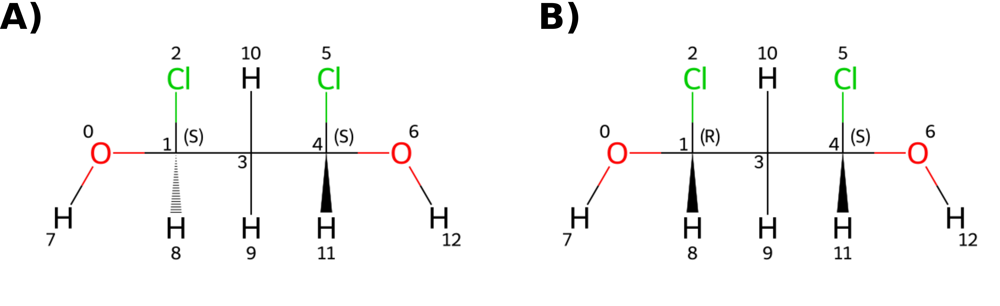

.. _faq:

FAQs
=====

*Are TABS dependent or independent on the atom order of otherwise identical molecules?*

As the atom numbering of a molecule is not canonicalized as part of the TABS code, it is possible to arrive at two different TABS for equivalent conformers of the same molecule if they differ in their atom ordering. 
The easiest way to resolve this is to renumber the atoms in one of the molecules to make the atom numberings equivalent; the RDKit provides code to do this and a usage example is provided in :code:`Demos/AtomRenumbering.ipynb`. 
In general for the analysis of conformer ensembles, it is recommended to work with one RDKit molecule containing all of the conformers in the ensemble.

*How is stereochemistry considered in TABS?*

TABS expects that all chiral centers in the molecule are defined. There is a check when creating the :code:`DihedralInfoFromTorsionLib` object that throws a warning if undefined stereochemistry is detected.
Furthermore, during the calculation of nTABS topological symmetry is considered, which includes stereochemical information.

The figure below shows two enantiomers of a molecule. Although they have the same connectivity and torsional angles, they differ in their stereochemistry and therefore yield different nTABS:
nTABS(A) = 6, nTABS(B) = 9.

   **A** ) :code:`O[C@@H](Cl)C[C@H](Cl)O` **B** ) :code:`O[C@H](Cl)C[C@H](Cl)O`

The TABS methodology also detects if cis/trans isomerism is defined for the nTABS calculation.
Hence, :code:`CCC=CCl` and :code:`CC/C=C/Cl` will yield different nTABS values (nTABS = 6 and nTABS = 3 respectively).

